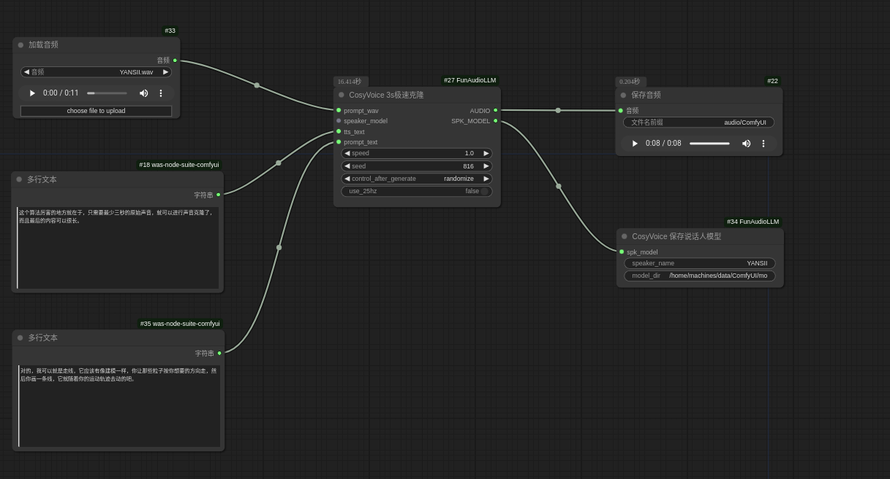
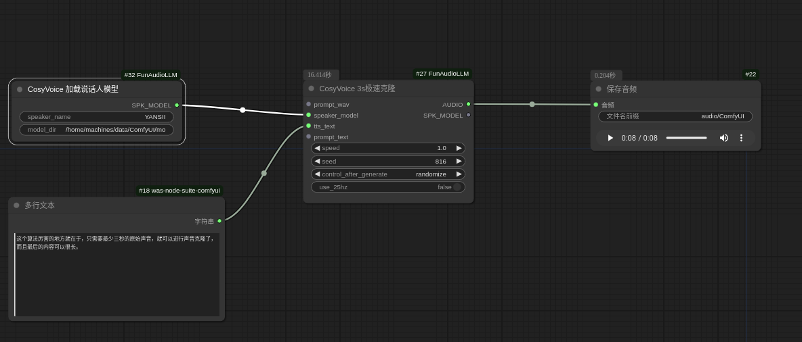
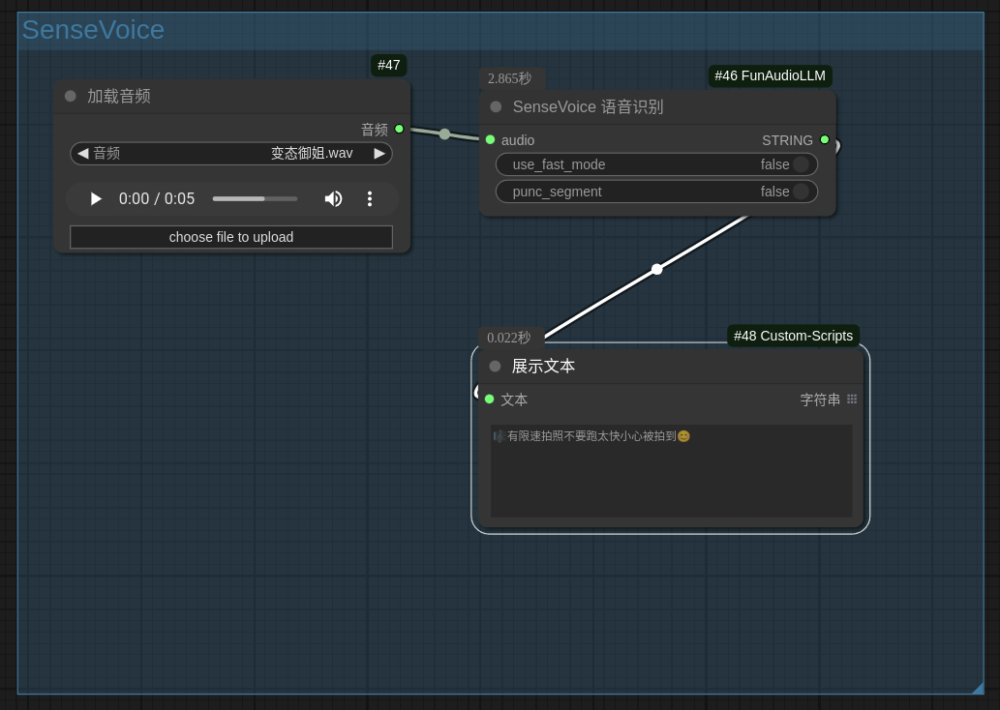
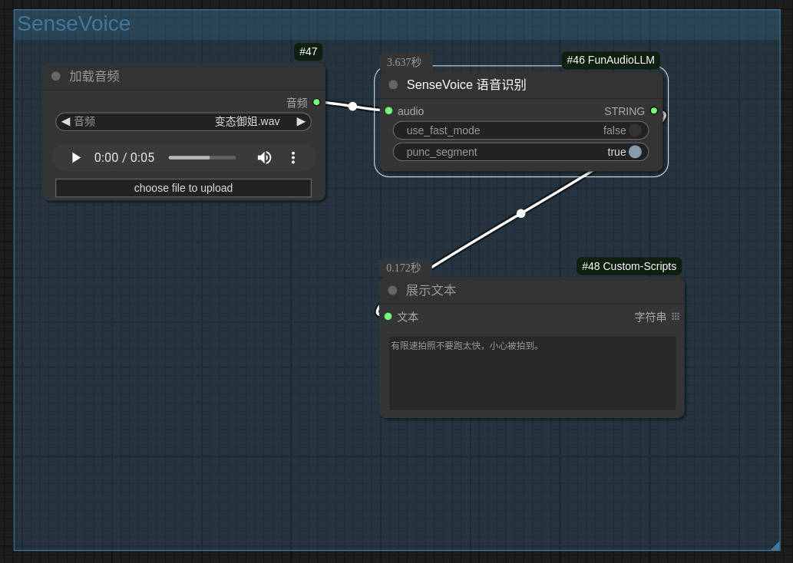
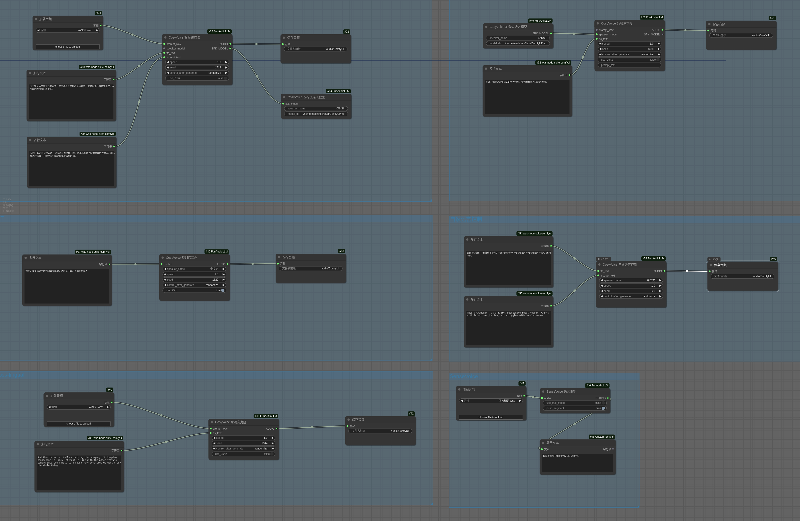

# 已支持CosyVoice2
## 新增内容：
 - 新增了多音字替换功能，配置在`funaudio_utils/多音字纠正配置.txt`。感谢https://github.com/touge/ComfyUI-NCE_CosyVoice/tree/main
 - 新增了3个CosyVoice2节点。
 - 整理了节点组。
 - 从官方更新了CosyVoice、SenseVoice、match，更新时间`2025-1-18`
 - 补充了更新CosyVoice后新增的参数`text_frontend`，作用应该是规范化文本，默认为`True`。
 - 优化了Speaker模型的保存与加载。
 - 因为CosyVoice2需要，采样率22050几乎全部改为了24000。
 - 加入了inspiremusic，有时间的话考虑支持。
## 使用说明：
 - 工作流详见示例workflow
 - 建议自动下载模型，不熟悉的话容易重复下载。想自己下载的请参考官方[CosyVoice](https://github.com/FunAudioLLM/CosyVoice)。
 - Speaker模型默认存储在 `/models/CosyVoice/Speaker`
 - 当以Speaker模型做为输入时，保存模型依然生效，但是保存的模型应该没有数据。
## 安装注意事项：
 - Windows系统需要使用conda，请自行学习conda使用。
 - 使用python3.10，torch<=2.4.1
 - 原项目推荐的pynini2.1.6会有问题，需使用官方推荐的2.1.5：
 ```bash
 conda install -y -c conda-forge pynini==2.1.5 
 pip install -r requirements.txt
 ```
 ---
# 以下是原项目说明：
## ComfyUI-FunAudioLLM
Comfyui custom node for [FunAudioLLM](https://funaudiollm.github.io/) include [CosyVoice](https://github.com/FunAudioLLM/CosyVoice) and [SenseVoice](https://github.com/FunAudioLLM/SenseVoice)

## Features

### CosyVoice
  - CosyVoice Version: 2024-10-04
  - Support SFT,Zero-shot,Cross-lingual,Instruct
  - Support CosyVoice-300M-25Hz in zero-shot and cross-lingual
  - Support SFT's 25Hz(unoffical)
  - <details>
      <summary>Save and load speaker model in zero-shot</summary>
       <br>
      
    </details>

### SenseVoice
  - SenseVoice Version: 2024-10-04
  - Support SenseVoice-Small
  - <details>
      <summary>Support Punctuation segment (need turn off use_fast_mode)</summary>
       <br>
      
    </details>

## How use
```bash
apt update
apt install ffmpeg

## in ComfyUI/custom_nodes
git clone https://github.com/SpenserCai/ComfyUI-FunAudioLLM
cd ComfyUI-FunAudioLLM
pip install -r requirements.txt

```

### Windows
In windows need use conda to install pynini
```bash
conda install -c conda-forge pynini=2.1.6
pip install -r requirements.txt

```

### MacOS
If meet error when you install
```bash
brew install openfst
export CPPFLAGS="-I/opt/homebrew/include"
export LDFLAGS="-L/opt/homebrew/lib"
pip install -r requirements.txt
```

If your network is unstable, you can pre-download the model from the following sources and place it in the appropriate directory.

- [CosyVoice-300M](https://modelscope.cn/models/iic/CosyVoice-300M) -> `ComfyUI/models/CosyVoice/CosyVoice-300M`
- [CosyVoice-300M-25Hz](https://modelscope.cn/models/iic/CosyVoice-300M-25Hz) -> `ComfyUI/models/CosyVoice/CosyVoice-300M-25Hz`
- [CosyVoice-300M-SFT](https://modelscope.cn/models/iic/CosyVoice-300M-SFT) -> `ComfyUI/models/CosyVoice/CosyVoice-300M-SFT`
- [CosyVoice-300M-SFT-25Hz](https://modelscope.cn/models/MachineS/CosyVoice-300M-SFT-25Hz) -> `ComfyUI/models/CosyVoice/CosyVoice-300M-SFT-25Hz`
- [CosyVoice-300M-Instruct](https://modelscope.cn/models/iic/CosyVoice-300M-Instruct) -> `ComfyUI/models/CosyVoice/CosyVoice-300M-Instruct`
- [SenseVoiceSmall](https://modelscope.cn/models/iic/SenseVoiceSmall) -> `ComfyUI/models/SenseVoice/SenseVoiceSmall`
     
## WorkFlow


